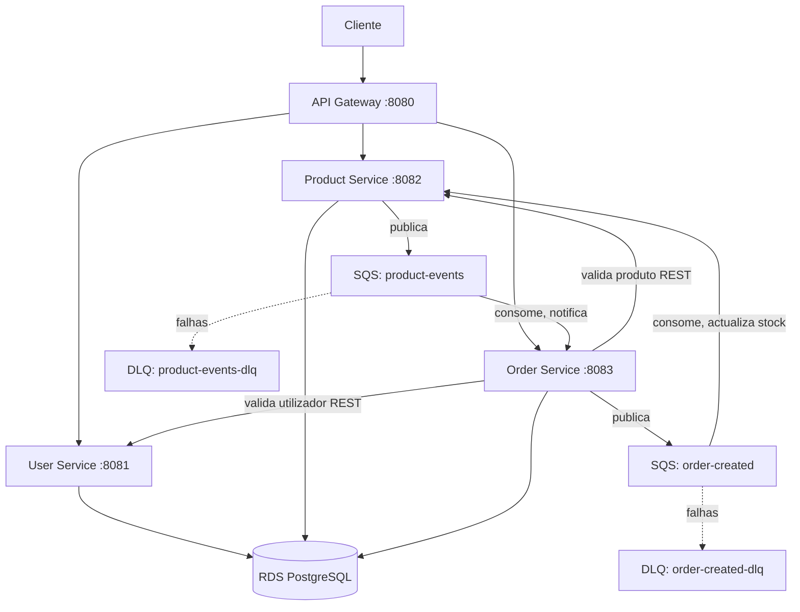
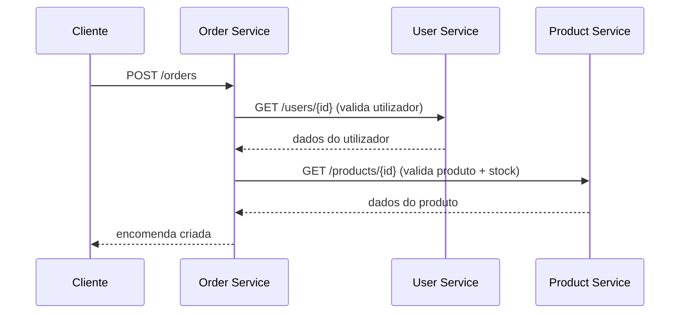
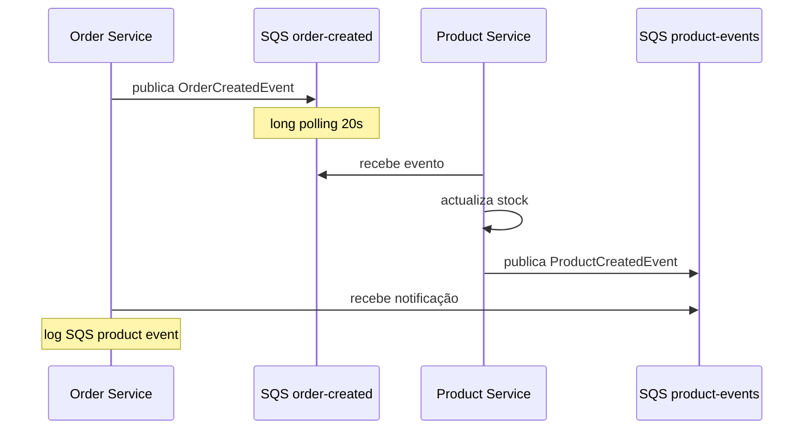

# Arquitectura do Sistema

## Visão Geral

O sistema implementa uma arquitectura de microserviços com comunicação síncrona (REST) e assíncrona (AWS SQS), deployada na AWS.

## Componentes

| Componente | Tecnologia | Função |
|---|---|---|
| API Gateway | Spring Cloud Gateway | Ponto de entrada único, roteamento para serviços |
| User Service | Spring Boot | CRUD de utilizadores |
| Product Service | Spring Boot | CRUD de produtos, gestão de stock |
| Order Service | Spring Boot | CRUD de encomendas, orquestração |
| RDS PostgreSQL | AWS RDS | Persistência em produção |
| SQS | AWS SQS | Comunicação assíncrona event-driven |

## Diagrama de Arquitectura

## Fluxos de Comunicação

### Comunicação Síncrona (REST via OpenFeign)

Quando uma encomenda é criada, o Order Service valida os dados em tempo real:

### Comunicação Assíncrona (AWS SQS)

Após criar a encomenda, eventos são publicados em filas SQS sem bloquear a resposta:

## Decisões Arquitecturais

### Porquê SQS em vez de Kafka?

A versão inicial usava Apache Kafka para comunicação assíncrona. Migrámos para AWS SQS pelas seguintes razões:

1. **Cloud-native:** SQS é um serviço totalmente gerido pela AWS. Kafka exigiria gerir um broker e Zookeeper na EC2.
2. **Recursos:** Kafka + Zookeeper consumiam ~800MB de RAM e espaço em disco significativo na EC2 `t3.micro` (Free Tier). SQS não consome recursos da instância.
3. **Escalabilidade:** SQS escala automaticamente sem intervenção.
4. **Custo:** Pago por mensagem (~$0.40/milhão) em vez do custo contínuo de uma instância a correr o broker.

### Porquê filas Standard e não FIFO?

As filas Standard oferecem maior throughput. A ordem exacta dos eventos não é crítica para o caso de uso (cada evento de produto/encomenda é processado independentemente). FIFO seria necessário apenas se a ordenação estrita fosse obrigatória.

### Padrão de activação por configuração

Os componentes SQS são activados via `@ConditionalOnProperty` e variáveis de ambiente (`cloud.sqs.*`). Isto permite:
- Desactivar SQS localmente (desenvolvimento sem AWS)
- Activar em produção apenas mudando variáveis de ambiente
- Não alterar código entre ambientes (princípio twelve-factor)

## Componentes Event-Driven

### Producer (Publisher)

Converte objectos de domínio em JSON e envia para a fila SQS via `SqsClient.sendMessage()`. Adiciona atributos de mensagem (ex: `eventType`) para filtragem.

### Consumer (Polling)

Faz long polling à fila (`@Scheduled` a cada 5s, com `waitTimeSeconds=20`). Ao receber uma mensagem:
1. Desserializa o JSON
2. Processa (ex: actualiza stock)
3. Apaga a mensagem da fila (`deleteMessage`)

Se o processamento falhar, a mensagem não é apagada, fica invisível durante o visibility timeout (60s) e é reprocessada. Após 5 tentativas falhadas, é movida para a Dead Letter Queue.

### Dead Letter Queue (DLQ)

Cada fila principal tem uma DLQ associada via redrive policy (`maxReceiveCount=5`). Mensagens que falham repetidamente são isoladas na DLQ para análise posterior, sem bloquear a fila principal.
