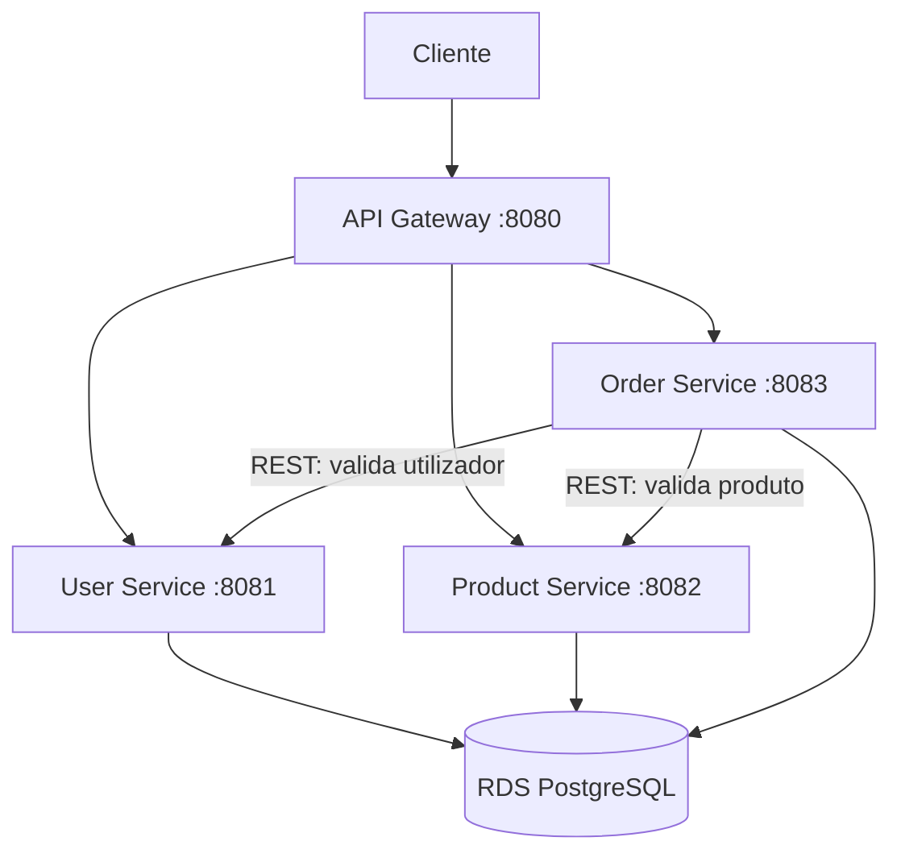
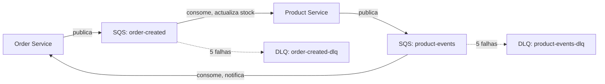
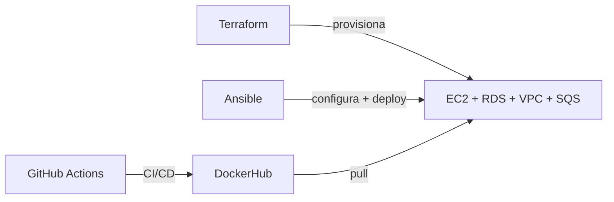
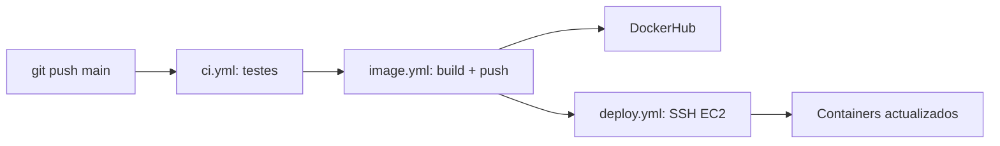
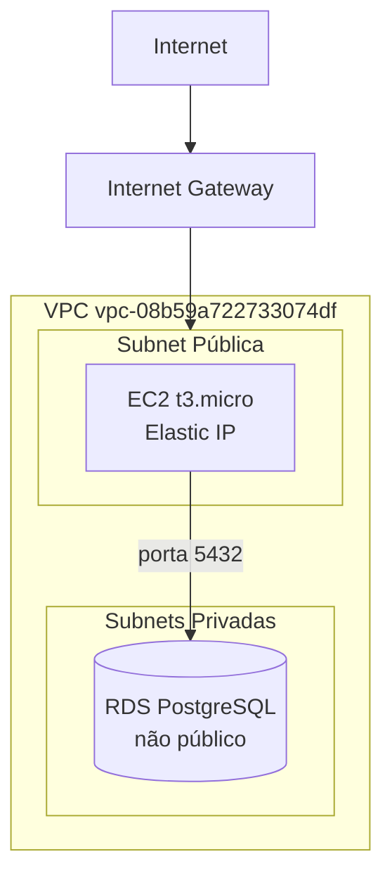

# Diagramas do Sistema

Este ficheiro contém os diagramas da arquitectura em formato Mermaid (renderizam automaticamente no GitHub).

## 1. Arquitectura Geral

## 2. Comunicação Assíncrona (AWS SQS)

## 3. Fluxo de Deployment

## 4. Pipeline CI/CD

## 5. Infraestrutura de Rede (VPC)

